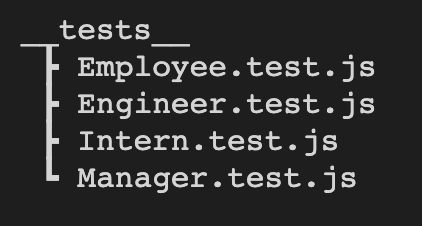
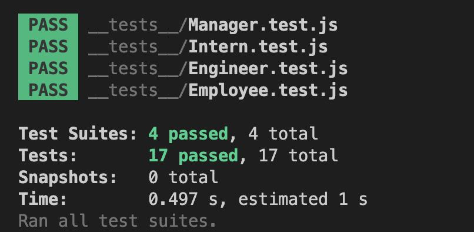
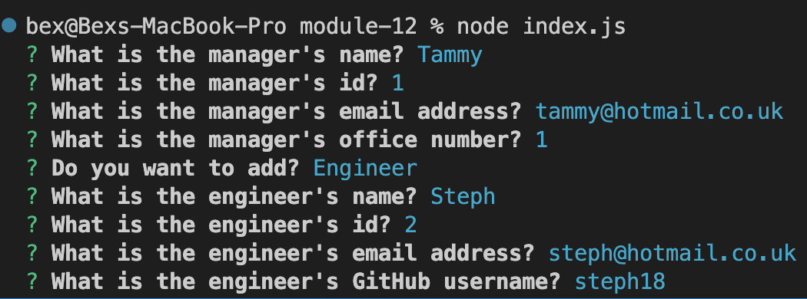
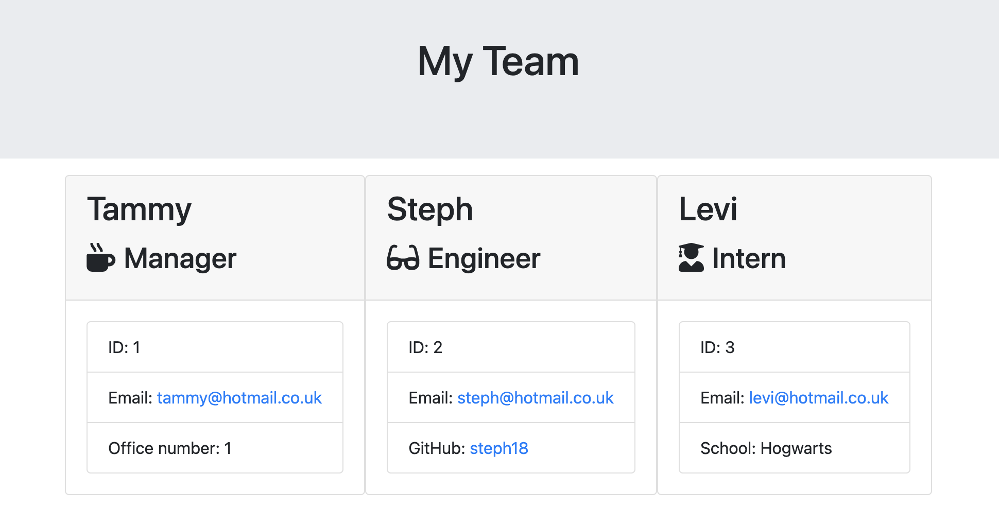

# Module 12 Object-Oriented Programming: Team Profile Generator

## Your Task

Your task is to take the given starter code and convert it into a working Node.js command-line application. This application will take in information about employees on a software engineering team, then generates an HTML webpage that displays summaries for each person. You have been provided with tests, so make sure every part of your code passes each provided test.

## User Story

As a manager a user want to generate a webpage that displays my team's basic info so that a user have quick access to their emails and GitHub profiles.

## Usage

This application used [Inquirer](https://www.npmjs.com/package/inquirer) for collecting input from the user. The application will be invoked by using the following command:

```bash
node index.js
```

This application used [Jest](https://www.npmjs.com/package/jest) for running the unit tests. The application will be invoked by using the following command:

```bash
npm tests
```
## Testing 
Below is an image of the file tree related to the testing aspect of this application.


All tests passed:


## Command Line
The user is presented with a series of questions. Once the user has answered all questions the final result will be in the **output** folder.


## Final Result 

The final result as displayed below. 



## GitHub 
[GitHub](https://github.com/bex-ford/module-12)

© 2023 Bex Ford
